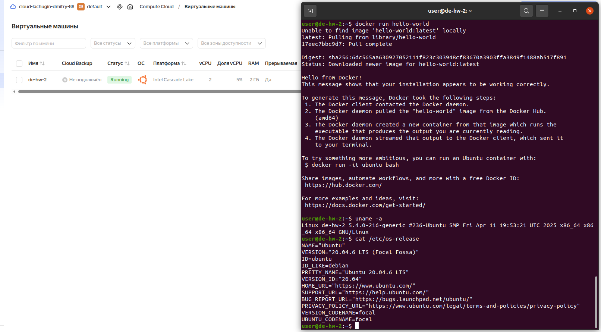

# ДЗ 02: Регистрация аккаунта в облаке

## Цель

Нужно зарегистрироваться в Yandex Cloud. Создать Linux VM. Установить в ней Docker. Запустить простой образ.

## Решение

* зарегистрирован аккаунт в Yandex Cloud
* добавлен платежный аккаунт
* создана виртуальная машина с Ubuntu 20.04
* на ВМ установлен Docker, следующим скриптом

```bash
sudo apt-get update
sudo apt-get install ca-certificates curl
sudo install -m 0755 -d /etc/apt/keyrings
sudo curl -fsSL https://download.docker.com/linux/ubuntu/gpg -o /etc/apt/keyrings/docker.asc
sudo chmod a+r /etc/apt/keyrings/docker.asc

echo \
  "deb [arch=$(dpkg --print-architecture) signed-by=/etc/apt/keyrings/docker.asc] https://download.docker.com/linux/ubuntu \
  $(. /etc/os-release && echo "$VERSION_CODENAME") stable" | \
  sudo tee /etc/apt/sources.list.d/docker.list > /dev/null
sudo apt-get update
sudo apt-get install docker-ce docker-ce-cli containerd.io docker-buildx-plugin docker-compose-plugin

sudo groupadd docker
sudo usermod -aG docker $USER
```

* на ВМ запущен простой образ

```bash
docker run hello-world
```

* сделан снимок экрана и предоставлен на проверку

<br>
