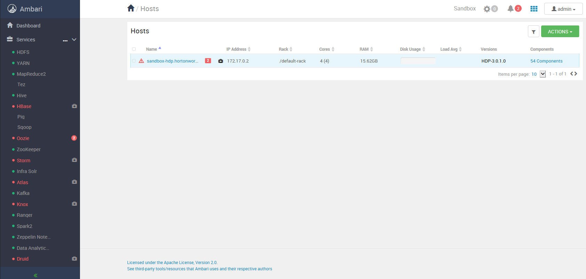
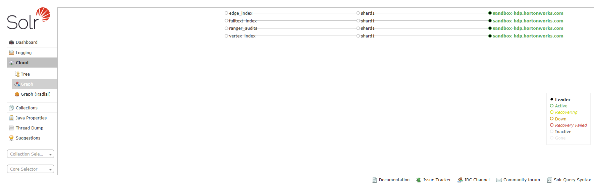
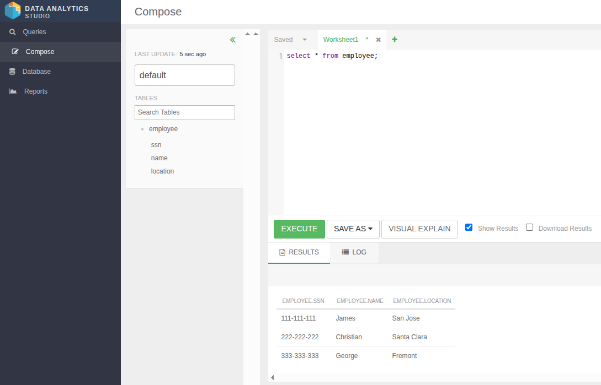

# ДЗ 04: Hadoop в Docker

## Цель

Нужно запустить Hadoop в Docker и настроить службы

## Решение

* в Yandex Cloud создана виртуальная машина с Ubuntu 20.04, 16 GB RAM, 50 GB HDD
* на локальном компьютере добавлен в файл `/etc/hosts` публичный IP-адрес VM под именем `sandbox-hdp.hortonworks.com`
* на ВМ установлен Docker, следующим скриптом

```bash
sudo apt-get update
sudo apt-get install ca-certificates curl
sudo install -m 0755 -d /etc/apt/keyrings
sudo curl -fsSL https://download.docker.com/linux/ubuntu/gpg -o /etc/apt/keyrings/docker.asc
sudo chmod a+r /etc/apt/keyrings/docker.asc

echo \
  "deb [arch=$(dpkg --print-architecture) signed-by=/etc/apt/keyrings/docker.asc] https://download.docker.com/linux/ubuntu \
  $(. /etc/os-release && echo "$VERSION_CODENAME") stable" | \
  sudo tee /etc/apt/sources.list.d/docker.list > /dev/null
sudo apt-get update
sudo apt-get install docker-ce docker-ce-cli containerd.io docker-buildx-plugin docker-compose-plugin

sudo groupadd docker
sudo usermod -aG docker $USER
```

* в Docker запущен Hortonworks HDP Sandbox (https://hub.docker.com/r/hortonworks/sandbox-hdp):

```bash
docker run -it --rm --hostname=sandbox-hdp.hortonworks.com --privileged=true -p 2222:22 -p 8080:8080 -p 1080:1080 -p 21000:21000 -p 6080:6080 -p 50070:50070 -p 9995:9995 -p 30800:30800 -p 4200:4200 -p 8088:8088 -p 19888:19888 -p 16010:16010 -p 11000:11000 -p 8744:8744 -p 8886:8886 -p 18081:18081 -p 8443:8443 -p 10000:10000 hortonworks/sandbox-hdp:3.0.1
```

* дефолтный логин `root`, дефолтный пароль `hadoop`
* вывод статуса Ambari:

```bash
[root@sandbox-hdp ~]# ambari-server status
Using python  /usr/bin/python
Ambari-server status
Ambari Server running
Found Ambari Server PID: 375 at: /var/run/ambari-server/ambari-server.pid
```

* заменить пароль от `admin` для Ambari командой

```bash
[root@sandbox-hdp ~]# ambari-admin-password-reset
The admin password has been set.
Restarting ambari-server to make the password change effective...

Using python  /usr/bin/python
Restarting ambari-server
Waiting for server stop...
Ambari Server stopped
Ambari Server running with administrator privileges.
Organizing resource files at /var/lib/ambari-server/resources...
Ambari database consistency check started...
Server PID at: /var/run/ambari-server/ambari-server.pid
Server out at: /var/log/ambari-server/ambari-server.out
Server log at: /var/log/ambari-server/ambari-server.log
Waiting for server start.................................
Server started listening on 8080

DB configs consistency check: no errors and warnings were found.
```

* открыть в браузере локального компьютера страницу `http://sandbox-hdp.hortonworks.com:8080`, залогиниться под пользователем `admin`
* проверка состояния служб **HDFS**, **YARN**, **Hive**, **Spark2**, **Zeppelin Notebook** и **Data Analytics Studio** (нормально отображается главная страница в браузере IE в виртуальной машине Windows 7. Скриншот с запущенными сервисами):

<br>

## Дополнительно

* используем инструкцию **Tag Based Policies with Apache Ranger and Apache Atlas** (https://github.com/hayari/data-tutorials/tree/master/tutorials/hdp/tag-based-policies-with-apache-ranger-and-apache-atlas)

* вносим изменения в конфиг **Ranger**, согласно инструкции: включаем Ranger's Audit для Solr и SolrCloud
* останавливаем сервисы:
  * **Spark2**
  * **Zeppelin**
* перезапускаем сервисы:
  * **Zookeeper**
  * **Infra Solr**
  * **Ranger**
  * **HDFS**
  * **YARN**
  * **Hive**
  * **HBase (Turn Off Maintenance Mode then Restart All HBase)**
  * **Storm (Turn Off Maintenance Mode then Restart All Storm)**
  * **Atlas (Turn Off Maintenance Mode then Restart All Atlas)**
  * **Kafka**
  * **Knox (Turn off Maintenance Mode then Restart All Knox)**

* убедиться в том, что применились `ranger_audits`. для этого перейти в **Ambari** -> **Infra Solr** -> **Quick Links** -> **Solr Admin UI**

<br>

* переходим в UI сервиса **Data Analytics Studio**
* создаем таблицу `employee` запросом:

```sql
create table employee (ssn string, name string, location string)
row format delimited
fields terminated by ','
stored as textfile;
```

* подключаемся с локального компьютера к образу в bash, и создаем файл в данными

```bash
$ ssh user@sandbox-hdp.hortonworks.com
[root@sandbox-hdp /]# cd /tmp
[root@sandbox-hdp tmp]# printf "111-111-111,James,San Jose\\n222-222-222,Christian,Santa Clara\\n333-333-333,George,Fremont" > employeedata.txt
```

* отправляем файл в HDFS

```bash
[root@sandbox-hdp tmp]# hdfs dfs -copyFromLocal employeedata.txt /warehouse/tablespace/managed/hive/employee
[root@sandbox-hdp tmp]#
```

* в **Data Analytics Studio** проверяем, что данные импортировались

```sql
select * from employee;
```

<br>

* в **Ranger UI** переходим в **sandbox_hive** (логин: admin, пароль: hortonworks1)

* отключаем политику `all - global`, отключаем специальную политику для `maria_dev` (как указано в инструкции)
* создаем новую политику для **maria_dev** и **raj_ops** с правами только на `select` исключая поря `ssn` и `location` (как в инструкции)

* перелогинимся в Ambari под `maria_dev` (пароль `maria_dev`)
* переходим в **Hive** и копируем ссылку **HIVESERVER2 JDBC URL**
* из терминала контейнера подключаемся под логином **maria_dev** по скопированному URL

```bash
[root@sandbox-hdp tmp]# beeline -n maria_dev -p maria_dev -u "jdbc:hive2://sandbox-hdp.hortonworks.com:2181/;serviceDiscoveryMode=zooKeeper;zooKeeperNamespace=hiveserver2"
SLF4J: Class path contains multiple SLF4J bindings.
SLF4J: Found binding in [jar:file:/usr/hdp/3.0.1.0-187/hive/lib/log4j-slf4j-impl-2.10.0.jar!/org/slf4j/impl/StaticLoggerBinder.class]
SLF4J: Found binding in [jar:file:/usr/hdp/3.0.1.0-187/hadoop/lib/slf4j-log4j12-1.7.25.jar!/org/slf4j/impl/StaticLoggerBinder.class]
SLF4J: See http://www.slf4j.org/codes.html#multiple_bindings for an explanation.
SLF4J: Actual binding is of type [org.apache.logging.slf4j.Log4jLoggerFactory]
Connecting to jdbc:hive2://sandbox-hdp.hortonworks.com:2181/;serviceDiscoveryMode=zooKeeper;zooKeeperNamespace=hiveserver2
25/12/01 10:09:41 [main]: INFO jdbc.HiveConnection: Connected to sandbox-hdp.hortonworks.com:10000
Connected to: Apache Hive (version 3.1.0.3.0.1.0-187)
Driver: Hive JDBC (version 3.1.0.3.0.1.0-187)
Transaction isolation: TRANSACTION_REPEATABLE_READ
Beeline version 3.1.0.3.0.1.0-187 by Apache Hive
0: jdbc:hive2://sandbox-hdp.hortonworks.com:2>
```

* пытаемся выполнить запрос на чтение всей информации и получаем ошибку, т.к. у **maria_dev** нет доступа ко всем полям

```bash
0: jdbc:hive2://sandbox-hdp.hortonworks.com:2> select * from employee;
Error: Error while compiling statement: FAILED: HiveAccessControlException Permission denied: user [maria_dev] does not have [SELECT] privilege on [default/employee/*] (state=42000,code=40000)
0: jdbc:hive2://sandbox-hdp.hortonworks.com:2> 
```

* пытаемся выполнить запрос на чтение только поля **name**, на которое у пользователя есть доступ

```bash
0: jdbc:hive2://sandbox-hdp.hortonworks.com:2> select name from employee;
INFO  : Compiling command(queryId=hive_20251201101707_b4507b14-a8d8-4300-9749-62d6e7abd064): select name from employee
INFO  : Semantic Analysis Completed (retrial = false)
INFO  : Returning Hive schema: Schema(fieldSchemas:[FieldSchema(name:name, type:string, comment:null)], properties:null)
INFO  : Completed compiling command(queryId=hive_20251201101707_b4507b14-a8d8-4300-9749-62d6e7abd064); Time taken: 0.347 seconds
INFO  : Executing command(queryId=hive_20251201101707_b4507b14-a8d8-4300-9749-62d6e7abd064): select name from employee
INFO  : Completed executing command(queryId=hive_20251201101707_b4507b14-a8d8-4300-9749-62d6e7abd064); Time taken: 0.008 seconds
INFO  : OK
+------------+
|    name    |
+------------+
| James      |
| Christian  |
| George     |
+------------+
3 rows selected (0.627 seconds)
0: jdbc:hive2://sandbox-hdp.hortonworks.com:2>
```
