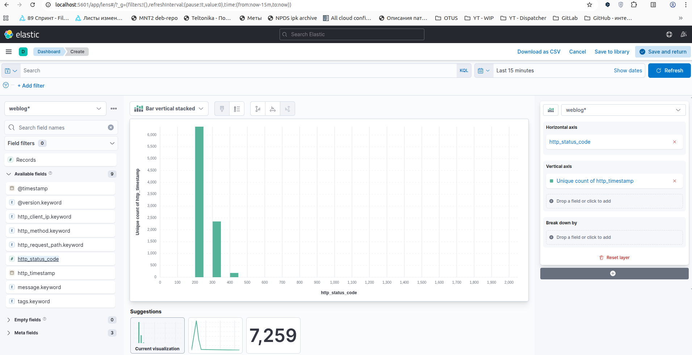

# ДЗ 05: Анализ веб-логов с помощью ELK

## Цель

* Написать конфигурацию Logstash для загрузки данных в ElasticSearch.
* Построить отчет в Kibana на основе этих данных.

## Решение

* стягиваем себе репозиторий `https://github.com/Gorini4/elk_demo`
* разворачиваем систему командой `docker compose up`
  * по окончании работы сворачиваем систему командой `docker compose down --remove-orphans`
* переходим по адресу `http://localhost:5601` в UI Kibana, заходим в DevTools и создаем индекс **weblog**:

```bash
PUT /weblog
{
  "settings": {
    "number_of_shards": 3,
    "number_of_replicas": 0
  }
}

#! Elasticsearch built-in security features are not enabled. Without authentication, your cluster could be accessible to anyone. See https://www.elastic.co/guide/en/elasticsearch/reference/7.14/security-minimal-setup.html to enable security.
{
  "acknowledged" : true,
  "shards_acknowledged" : true,
  "index" : "weblog"
}
```

* либо в UI Kibana можно перейти в **Stack Management** > **Index Patterns** > **Create index pattern** и добавить индекс **weblog**

* исходный файл с веб-логами (`hw05/elk_demo/logstash/weblog.csv`) имеет следующий формат:

```text
IP,Time,URL,Status
10.128.2.1,[29/Nov/2017:06:58:55,GET /login.php HTTP/1.1,200
10.128.2.1,[29/Nov/2017:06:59:02,POST /process.php HTTP/1.1,302
...
```

* для разбора веб-логов пишем следующую конфигурацию в файле `hw05/elk_demo/logstash/clickstream.conf`:

```conf
input {
  file {
    path => "/app/weblog.csv"
    start_position => "beginning"
  }
}

filter {
  csv {
    separator => ","
    columns => ["raw_ip", "raw_time", "raw_request", "raw_status"]
  }
  grok {
    match => {
      "raw_ip" => "%{IP:http_client_ip}"
    }
  }
  mutate {
    rename => {
      "raw_status" => "http_status_code"
    }
    convert => {
      "http_status_code" => "integer"
    }
  }
  mutate { # '[29/Nov/2017:06:59:02' ==> '29/Nov/2017:06:59:02'
    gsub => ["raw_time", "^\[", ""]
  }
  grok {
    match => {
      "raw_time" => "%{INT:day}/%{WORD:month}/%{INT:year}:%{WORD:hours}:%{WORD:minutes}:%{WORD:seconds}"
    }
  }
  ruby { # '29/Nov/2017:06:59:02' ==> '2017-11-29T06:59:02'
    code => "
      month_map = {
        'Jan' => '01', 'Feb' => '02', 'Mar' => '03',
        'Apr' => '04', 'May' => '05', 'Jun' => '06',
        'Jul' => '07', 'Aug' => '08', 'Sep' => '09',
        'Oct' => '10', 'Nov' => '11', 'Dec' => '12'
      }
      event.set('http_timestamp', event.get('year') + '-' + month_map[event.get('month')] + '-' + event.get('day') + 'T' + event.get('hours') + ':' + event.get('minutes') + ':' + event.get('seconds'))
    "
  }
  grok {
    match => {
      "raw_request" => "%{WORD:http_method} %{NOTSPACE:http_request_path} HTTP/%{NUMBER:http_version}"
    }
  }
  mutate {
    remove_field => [
      "path", "host", "raw_ip", "raw_time", "raw_request", "day", "month", "year", "hours", "minutes", "seconds", "http_version"
    ]
  }
}

output {
  elasticsearch {
    hosts => "elasticsearch"
    index => "weblog"
  }
  stdout { codec => rubydebug }
}
```

* запускаем Logstash, выполнив команду `./load_data.sh`, чтобы загрузить данные веб-логов из файла
* убеждаемся, что по логам всё отрабатывает успешно (кроме случаев строк, которые не подходят под шаблоны):

```bash
...
{
    "http_request_path" => "/showcode.php?id=309&nm=ham05",
           "@timestamp" => 2026-01-21T08:41:06.672Z,
              "message" => "10.130.2.1,[02/Mar/2018:15:47:32,GET /showcode.php?id=309&nm=ham05 HTTP/1.1,200\r",
          "http_method" => "GET",
       "http_timestamp" => "2018-03-02T15:47:32",
       "http_client_ip" => "10.130.2.1",
             "@version" => "1",
     "http_status_code" => 200
}

{
             "message" => "IP,Time,URL,Status\r",
            "@version" => "1",
    "http_status_code" => 0,
          "@timestamp" => 2026-01-21T08:30:39.920Z,
                "tags" => [
        [0] "_grokparsefailure",
        [1] "_rubyexception"
    ]
}
{
             "message" => "chmod:,cannot,'a.out':,No\r",
            "@version" => "1",
    "http_status_code" => 0,
          "@timestamp" => 2026-01-21T08:30:39.935Z,
                "tags" => [
        [0] "_grokparsefailure",
        [1] "_rubyexception"
    ]
}
...
```

* в UI Kibana переходим в **Dashboards** > **Create visualisation**
* формируем dashboard, показывающий распределение запросов с разными status_code по времени

<br>
