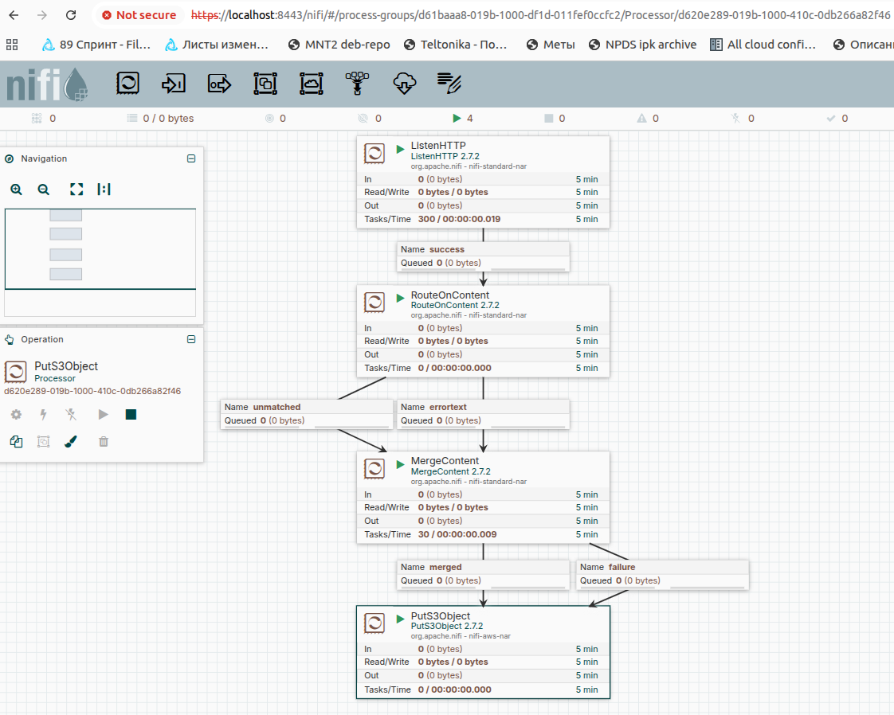
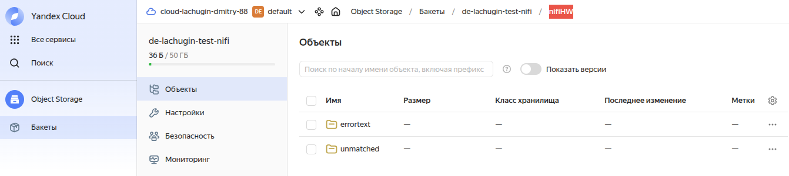
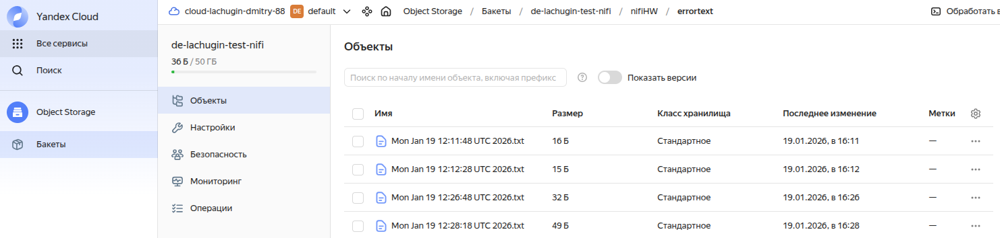

# ДЗ 06: Загрузка сырых данных (Apache NiFi)

## Цель

Настроить data pipeline в Apache NiFi, который будет:

* получать данные, отправляемые по HTTP (по сути, работать как API);
* анализировать содержимое того, что ему прислали;
* выполнять некоторые преобразования (склейку);
* сохранять результат в отдельную директорию в соответствии с контентом.

## Решение

* развернем систему, воспользовавшись командой

```bash
docker compose -f docker-compose.hw-06.yml up -d
```

* по окончании работы остановить систему командой

```bash
docker compose -f docker-compose.hw-06.yml down --remove-orphans
```

* в Yandex Cloud создаем бакет (**de-lachugin-test-nifi**) в Object Storage

* в Yandex Cloud в IAM создаем сервисный аккаунт с ролями **storage.viewer** и **storage.uploader** и получаем для него комбинацию `Access Key`/`Secret Key`

* Apache NiFi запускается с пробросом двух портов:
  * 8443 - для доступа в UI
  * 8081 - для работы с модулируемым API

* ищем в логах запущенного сервиса NiFi сгенерированные логин/пароль:

```bash
docker compose -f docker-compose.hw-06.yml logs nifi
...
nifi  | Generated Username [4cabf914-12e0-49f4-b2cf-a2d87521d204]
nifi  | Generated Password [6+LS8s7pEz8zsaWm9vpYucpoen/kpn2O]
...
```

* заходим на UI интерфейс Apache NiFi по пути `https://localhost:8443/nifi` и авторизуемся

* создаем следующие элементы:
  * `ListenHTTP`:  
    * порт **`8081`**  
    * базовый путь **`loglistener`**
  * `RouteOnContent`:  
    * тип совпадения **`content must contain match`**  
    * добавляем ему новое свойство errortext со значением **`ERROR`**
    * соединяем success-связью с `ListenHTTP` процессором
  * `MergeContent`:
    * Merge Strategy - **`Bin-Packing Algorithm`**
    * Merge Format - **`Binary Concatenation`**
    * Maximum Number of Entries - **`500`**
    * Maximum Bin Age - **`90s`**
    * Delimiter Strategy - **`Text`**
    * Demarcator - **`Shift+Enter`**
    * Correlation Attribute Name - **`RouteOnContent.Route`**
    * Scheduling -> Run Schedule - **`10s`**
    * соединяем unmatched-связью с `RouteOnContent` процессором
    * соединяем errortext-связью с `RouteOnContent` процессором
  * `PutS3Object`:  
    * Bucket - **`de-lachugin-test-nifi`**
    * Object Key - **`nifiHW/${RouteOnContent.Route}/${now()}.txt`**
    * Region -> Use Custom Region - **`ru-central-1`**
    * Endpoint Override URL - **`https://storage.yandexcloud.net/`**
    * AWS Credentials Provider Service -> Добавить новый
  * `AWS Credentials Provider Service`:
    * Access Key ID - **полученный для сервис-аккаунта в YC**
    * Secret Access Key - **полученный для сервис-аккаунта в YC**
    * Enable Service

* запускаем весь пайплайн, схема должна получиться следующей

<br>

* проверяем запросами с хост машины на настроенный порт и эндпойинт

```bash
curl -X POST --data "ERROR someRandomText" localhost:8081/loglistener

curl -X POST --data "ololo" localhost:8081/loglistener

curl -X POST --data "pupupu -- ERROR" localhost:8081/loglistener
```

* смотрим как у нас отрабатывает пайплайн в NiFi

<br>

* смотрим, что в Yandex Cloud в бакете создался каталог **nifiHW**, в нем два подкаталога:  
  * **nifiHW/errortext/**
  * **nifiHW/unmatched/**

<br>

* в соответствующих подкаталогах создаются файлы по таймстампам событий отправки сообщений через утилиту curl

<br>

* примеры содержимого файла

```text
test ERROR ololo
test ERROR ololo
pupupu -- ERROR
```

```text
ololo
```
