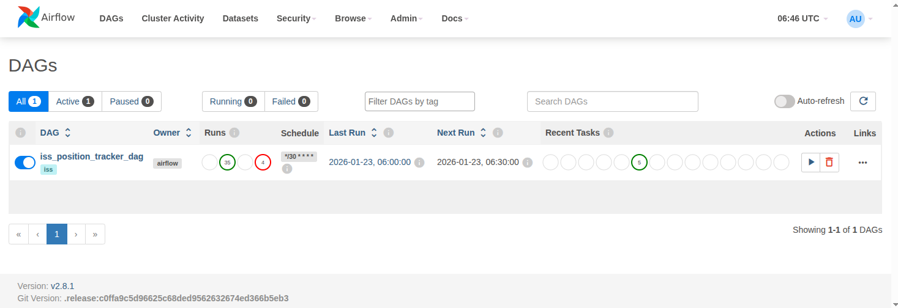
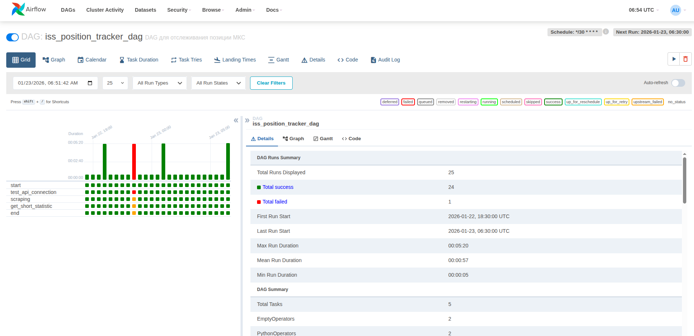
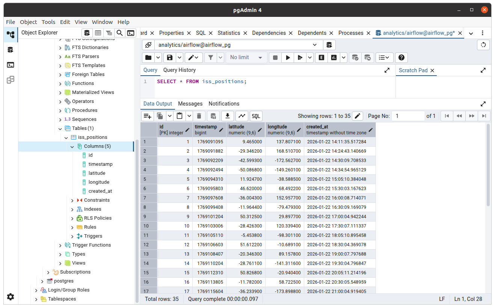

# ДЗ 07: Подготовка и установка на расписание DAG выгрузки данных из источников (Apache Airflow)

## Цель

настроить автоматический data pipeline, который будет получать данные из публичного API и складывать их в БД для дальнейшего анализа.

* настроить инстанс Apache Airflow
* настроить Data pipeline, содержащий в себе несколько task-ов и «крутящийся» по расписанию Airflow
* настроить инстанс СУБД, куда Airflow заливает данные, получаемые из внешнего API
* убедиться в том, что данные из внешнего источника успешно складываются в СУБД для дальнейшего анализа

## Решение

* в качестве внешнего источника данных выбран API с положением Международной Космической Станции на текущий момент времени
  * URI: `http://api.open-notify.org/iss-now.json`
  * формат возвращаемых данных

    ```json
    {
      "iss_position": {
        "latitude": "-45.8245",
        "longitude": "-62.2880"
      },
      "message": "success",
      "timestamp": 1768914738
    }
    ```

  * сохранять будем данные
    * `timestamp`
    * `iss_position.latitude`
    * `iss_position.longitude`
  * структура таблицы **iss_positions** в БД **analytics** для сохранения данных (скрипт см. в файле `hw07/airflow_demo/airflow/init/init_db.py`)

    ```sql
    CREATE TABLE IF NOT EXISTS iss_positions (
        id          SERIAL          PRIMARY KEY,
        timestamp   BIGINT          NOT NULL,
        latitude    DECIMAL(9,6)    NOT NULL,
        longitude   DECIMAL(9,6)    NOT NULL,
        created_at  TIMESTAMP       DEFAULT CURRENT_TIMESTAMP,
        UNIQUE(timestamp)
    );
    ```

* для развертывания системы был получен проект в каталоге `airflow_demo/airflow`.
* предварительно нужно выполнить `docker compose build`
* разворачиваем систему командами:

  ```bash
  docker compose up airflow-init
  docker compose up -d
  ```

  * после выполнения контейнера `airflow-init` будут запущена БД, настроены пользователи
  * ПРИМЕЧАНИЕ: немного модифицировал файл `docker-compose.yml`, теперь по окончании работы контейнера `airflow-init` будет вызван скрипт `hw07/airflow_demo/airflow/init/init_db.py`, который создаст базу **analytics** и таблицу **iss_positions** в ней

    ```text
    airflow-init  | Initialization done
    airflow-init  | admin already exist in the db
    airflow-init  | база данных 'analytics' создана
    airflow-init  | таблица `iss_positions` создана
    ```

  * когда закончим - сворачиваем систему командой:

    ```bash
    docker compose down --volumes --remove-orphans
    ```

* убедиться, что база **analytics** создана

```bash
docker exec -it airflow-postgres-1 psql -U airflow -c "\l"
                               List of databases
   Name    |  Owner  | Encoding |  Collate   |   Ctype    |  Access privileges  
-----------+---------+----------+------------+------------+---------------------
 airflow   | airflow | UTF8     | en_US.utf8 | en_US.utf8 | 
 analytics | airflow | UTF8     | en_US.utf8 | en_US.utf8 | 
 postgres  | airflow | UTF8     | en_US.utf8 | en_US.utf8 | 
 template0 | airflow | UTF8     | en_US.utf8 | en_US.utf8 | =c/airflow         +
           |         |          |            |            | airflow=CTc/airflow
 template1 | airflow | UTF8     | en_US.utf8 | en_US.utf8 | =c/airflow         +
           |         |          |            |            | airflow=CTc/airflow
(5 rows)
```

* убедиться, что таблица **iss_positions** в базе **analytics** создана

```bash
docker exec -it airflow-postgres-1 psql -U airflow -d analytics -c "
SELECT column_name, data_type, is_nullable, column_default
  FROM information_schema.columns
 WHERE table_schema = 'public'
   AND table_name = 'iss_positions';
"
 column_name |          data_type          | is_nullable |              column_default               
-------------+-----------------------------+-------------+-------------------------------------------
 id          | integer                     | NO          | nextval('iss_positions_id_seq'::regclass)
 timestamp   | bigint                      | NO          | 
 latitude    | numeric                     | NO          | 
 longitude   | numeric                     | NO          | 
 created_at  | timestamp without time zone | YES         | CURRENT_TIMESTAMP
(5 rows)
```

* развернутая система будет состоять:
  * из набора сервисов Airflow:
    * **airflow-webserver**
    * **airflow-triggerer**
    * **airflow-scheduler**
    * **airflow-flower** (celery flower)
    * **airflow-worker** (celery worker)
  * для работы celery запущено:
    * **redis** - в качестве брокера (и бэкенд сторедж для него **postgres**)
  * также в качестве хранилища системы запущен:
    * **postgres**

* ПРИМЕЧАНИЕ: возможно потребуется установить владение для airflow  
`sudo chown 50000:0 logs/`  
потому что **airflow-webserver** падал с ошибками уровней доступа

  ```bash
  airflow-webserver  | FileNotFoundError: [Errno 2] No such file or directory: '/opt/airflow/logs/scheduler/2026-01-22'
  airflow-webserver  | PermissionError: [Errno 13] Permission denied: '/opt/airflow/logs/scheduler'
  ```

* доступ к Airflow UI:
  * URI: `http://localhost:8080`
  * Username/Password: `admin/admin`

* доступ к Celery monitoring UI:
  * URI: `http://localhost:5555`

* в Airflow UI создаем
  * подключение (**Admin** > **Connections** > **Add new connection**) для PostgreSQL:
    * Connection Id: `postgres_iss_conn_id`
    * Connection Type: `Postgres`
    * Host: `postgres`
    * Port: `5432`
    * Database: `iss_positions`
    * Login: `airflow`
    * Password: `airflow`
  * подключение (**Admin** > **Connections** > **Add new connection**) для HTTP API:
    * Connection Id: `api_iss_conn_id`
    * Connection Type: `HTTP`
    * Host: `http://api.open-notify.org`
    * Port: `80`
    * Schema: `<пусто>`
    * Login: `<пусто>`
    * Password: `<пусто>`

* кастомный Operator (**IssScrapingOperator**) находится в файле `hw07/airflow_demo/airflow/plugins/operators/iss_operator.py`
* кастомный Hook (**IssHook**) находится в файле `hw07/airflow_demo/airflow/plugins/hooks/iss_hook.py`
* DAG (dag_id=**iss_position_tracker_dag**) находится в файле `hw07/airflow_demo/airflow/dags/iss_tracker_dag.py`
* основные шаги в цепочке DAG:
  1. проверить что API для получения данных о положении МКС доступно
  2. стянуть информацию с внешнего API

      * отправить GET-запрос на внешний API
      * распарсить JSON ответа
      * сохранить данные в таблицу в БД

  3. вывести небольшую статистику по данным в БД

* под "вывести небольшую статистику по данным" понимается то, что в логи пишется следующая информация

```log
[2026-01-23, 05:30:09 UTC] {iss_tracker_dag.py:35} INFO - Статистика по данным ISS:
[2026-01-23, 05:30:09 UTC] {iss_tracker_dag.py:36} INFO - Всего записей   : 33
[2026-01-23, 05:30:09 UTC] {iss_tracker_dag.py:37} INFO - Первая запись   : 2026-01-22 14:11:35.517284
[2026-01-23, 05:30:09 UTC] {iss_tracker_dag.py:38} INFO - Последняя запись: 2026-01-23 05:30:07.846524
```

* в Airflow UI запущенный на выполнение в оркестраторе (каждые 30 минут `*/30 * * * *`) DAG выглядит так

<br>

* в Airflow UI детализация по выполненным таскам выглядит так

<br>

* если подключиться к базе данных, например через pgAdmin, то можно например вывести некоторое количество сохраненных данных

<br>