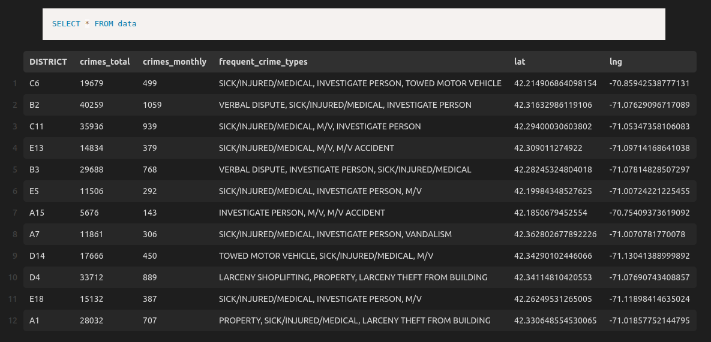

# ДЗ 07: Подготовка и установка на расписание DAG выгрузки данных из источников (Apache Airflow)

## Цель

* собрать статистику по криминогенной обстановке в разных районах Бостона
* разработать программу построения витрины на Spark

## Решение

### Описание

* в качестве источников данных используется ресурс `https://www.kaggle.com/datasets/AnalyzeBoston/crimes-in-boston`
  * загружен файл **offense_codes.csv** (`hw08/data/inbox/offense_codes.csv`), представляющий CSV-справочник названий и кодов нарушений
  * загружен файл **crime.csv** (`hw08/data/inbox/crime.csv.zip`), представляющий CSV-базу нарушений  
    (**ПРИМЕЧАНИЕ**: в репозитории находится архив, чтобы не занимать лишнее место, поэтому надо разархивировать **crime.csv.zip**, чтобы получить файл `hw08/spark_demo/data/inbox/crime.csv`)
* написана программа на PySpark (`hw08/spark_demo/scripts/boston_crime_stats.py`), для подготовки витрины:
  * запускается через **spark-submit**
  * пути к исходным файлам данных и к файлу с результатами передаются через ключи командной строки
  * исходные данные загружаются из файлов
  * валидируем данные:
    * производим очистку
    * избавляемся от дубликатов в справочнике кодов
    * т.к. данные по месяцам с 2015 по 2018 год, а нам нужно по месяцам - преобразуем дату в виде "год-месяц"
    * из таблицы **offense_codes** парсим поле NAME, разбиваем по разделителю `-` и берем первую часть в качестве значения **crime_type**
    * для подсчета медианы применяется функция **percentile_approx**
  * собираем витрину (агрегат по районам (поле `district`)) со следующими метриками:
    * `crimes_total` — общее количество преступлений в этом районе
    * `crimes_monthly` — медиана числа преступлений в месяц в этом районе
    * `frequent_crime_types` — три самых частых crime_type за всю историю наблюдений в этом районе, объединенных через запятую с одним пробелом (`, `) и расположенных в порядке убывания частоты
    * `crime_type` — первая часть NAME из таблицы offense_codes
    * `lat` — широта координаты района, рассчитанная как среднее по всем широтам инцидентов
    * `lng` — долгота координаты района, рассчитанная как среднее по всем долготам инцидентов
  * результат (витрину) сохраняем в файл в формате **.parquet**

### Разворачиваем окружение

* переходим в каталог `hw08/spark_demo/`, в нем располагается подготовленный файл **docker-compose.yml**
  * в образе используются конфиги из каталога `hw08/spark_demo/conf/`
  * в контейнер монтируется каталог `hw08/spark_demo/data/outbox/` -> `/app/out_data/`, тут будет лежать подготовленная витрина в виде parquet-файла
  * в контейнер монтируется каталог `hw08/spark_demo/data/inbox/` -> `/app/in_data/`, тут лежат исходные данные в виде csv-файлов
  * в контейнер монтируется каталог `hw08/spark_demo/scripts` -> `/app/scripts`, тут располагаются PySpark-скрипты
* собираем образ: `docker compose build`
* запускаем контейнер с локальным Spark: `docker compose up -d`
  * по окончании работы сворачиваем окружение: `docker compose down --volumes --remove-orphans`
* попадаем внутрь контейнера, для работы со скриптами: `docker compose exec spark-local bash`
* проверяем версию

  ```bash
  root@spark_local:/app# pyspark
  Python 3.11.14 (main, Jan 13 2026, 03:12:14) [GCC 14.2.0] on linux
  Type "help", "copyright", "credits" or "license" for more information.
  26/01/30 12:19:12 WARN NativeCodeLoader: Unable to load native-hadoop library for your platform... using builtin-java classes where applicable
  Welcome to
        ____              __
       / __/__  ___ _____/ /__
      _\ \/ _ \/ _ `/ __/  '_/
     /__ / .__/\_,_/_/ /_/\_\   version 3.5.7
        /_/
  
  Using Python version 3.11.14 (main, Jan 13 2026 03:12:14)
  Spark context Web UI available at http://localhost:4040
  Spark context available as 'sc' (master = local[*], app id = local-1769775553235).
  SparkSession available as 'spark'.
  >>> spark.version
  '3.5.7'
  >>>
  ```

* проверяем выполнение

  ```bash
  root@spark_local:/opt/spark# /opt/spark/bin/run-example SparkPi 10
  26/01/30 12:20:24 WARN NativeCodeLoader: Unable to load native-hadoop library for your platform... using builtin-java classes where applicable
  26/01/30 12:20:24 WARN SparkContext: The JAR file:/opt/spark-3.5.7-bin-hadoop3/examples/jars/spark-examples_2.12-3.5.7.jar at spark://localhost:36861/jars/spark-examples_2.12-3.5.7.jar has been added already. Overwriting of added jar is not supported in the current version.
  Pi is roughly 3.1387671387671388
  ```

* запускаем на выполнение скрипт (вызывается сам скрипт, а также передаются в параметрах командной строки: (а) путь в каталогу с исходными данными, (б) путь к каталогу, в котором сохраняется файл с витриной)

  ```bash
  root@spark_local:/app# spark-submit --master local[*] --name "Boston Crimes" /app/scripts/boston_crime_stats.py /app/in_data /app/out_data
  26/02/02 10:42:06 WARN NativeCodeLoader: Unable to load native-hadoop library for your platform... using builtin-java classes where applicable
  root@spark_local:/app# 
  ```

* по завершении получаем витрину `hw08/spark_demo/data/outbox/mart_data.parquet`.  
  при установленном расширении в VSCode содержимое бинарного файла выглядит так:

<br>
