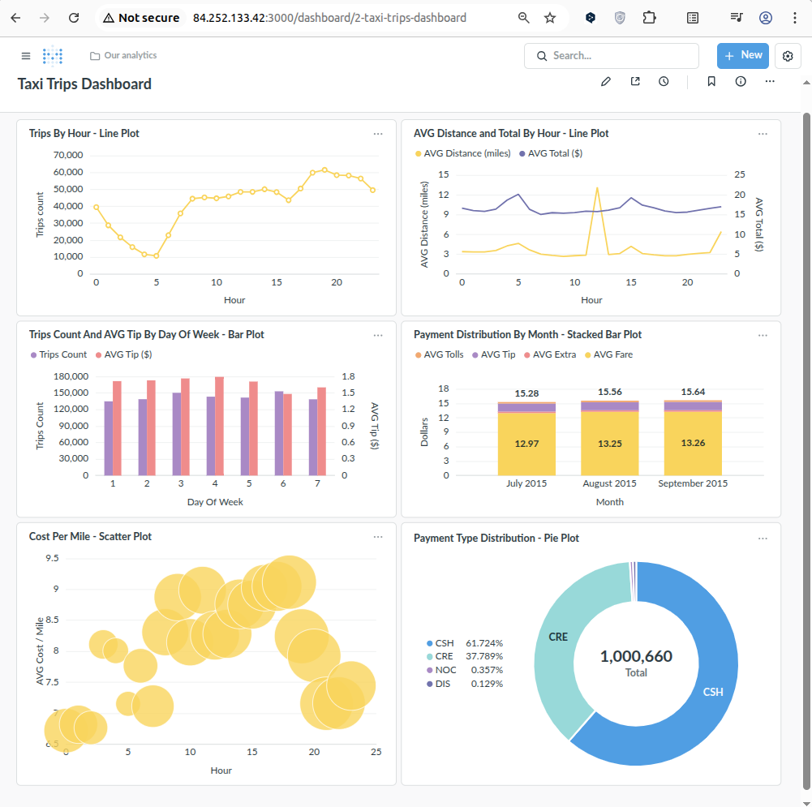

# ДЗ 09: Витрина + BI

## Цель

* развернуть виртуальную машину с ClickHouse в Yandex.Cloud
* загрузить данные в ClickHouse
* развернуть виртуальную машину с Metabase в Yandex.Cloud
* подключить Metabase к источнику данных ClickHouse
* создать дашборд

## Решение

### Подготовка

Для начала, установить **Yandex CLI** (инструкция: https://yandex.cloud/ru/docs/cli/quickstart)

* установить утилиту командой

  ```bash
  curl -sSL https://storage.yandexcloud.net/yandexcloud-yc/install.sh | bash
  ```

* добавить утилиту в PATH
* выполнить команду `yc init` для настройки профиля.  
  на шагах настройки утилита попросит перейти по ссылке, залогиниться в профиле Yandex.Cloud и получить токен OAuth, который будет использоваться утилитой в созданном профиле при обращении к API Yandex.Cloud
* далее, утилита соберет информацию о доступных облаках и каталогах у аккаунта, затем предложит выбрать какие из них использовать по умолчанию или создать
* затем утилита предложит настроить Compute zone, в которой будет по умолчанию производить работу
* по окончанию настроек, можно выполнить команду `yc config list` и посмотреть параметры

  ```bash
  token: y0__xC*********************************************kg
  cloud-id: b1g48efsveb*********
  folder-id: b1ggqf2b71**********
  compute-default-zone: ru-central1-d
  ```

В проекте также используется утилита **uv** (инструкция: https://docs.astral.sh/uv/getting-started/installation/#cargo)

* установить утилиту командой

  ```bash
  curl -LsSf https://astral.sh/uv/install.sh | sh
  ```

* выполнить пару команд, чтобы добавить автодополнения

  ```bash
  echo 'eval "$(uv generate-shell-completion bash)"' >> ~/.bashrc
  echo 'eval "$(uvx --generate-shell-completion bash)"' >> ~/.bashrc
  ```

* перейти в нужный каталог и выполнить `uv init`
* в файле `pyproject.toml` описать все записимости по библиотекам

Также в проекте используется Python библиотека Invoke, для упрощения работы и автоматизации. Эта библиотека будет установлена с виртуальное окружение. Затем нужно будет наполнить файл `tasks.py` необходимыми скриптами.

### Развертывание

* переходим в каталог `hw09/bi_demo` и инициализируем окружение.  
  это установит зависимости требуемых пакетов (из файла `hw09/bi_demo/pyproject.toml`), позволит создавать и удалять Python виртуальное окружение .venv при работе с Ansible, а также установит Python пакет Invoke, для удобства:

  ```bash
  dmitry@lachugin:~/otus/lachugin_de_homeworks/hw09/bi_demo$ uv sync 
  Using CPython 3.8.10 interpreter at: /usr/bin/python3.8
  Creating virtual environment at: .venv
  Resolved 17 packages in 17.39s
  Prepared 12 packages in 16.35s
  Installed 12 packages in 313ms
   + ansible==6.7.0
   + ansible-core==2.13.13
   + cffi==1.17.1
   + cryptography==46.0.5
   + invoke==2.2.1
   + jinja2==3.1.6
   + markupsafe==2.1.5
   + packaging==26.0
   + pycparser==2.23
   + pyyaml==6.0.3
   + resolvelib==0.8.1
   + typing-extensions==4.13.2
  ```

* просмотр доступных Invoke-команд (`hw09/bi_demo/tasks.py`):

  ```bash
  dmitry@lachugin:~/otus/lachugin_de_homeworks/hw09/bi_demo$ source .venv/bin/activate
  (bi-demo) dmitry@lachugin:~/otus/lachugin_de_homeworks/hw09/bi_demo$ inv -l
  Available tasks:
  
    configure-clickhouse   Install and configure ClickHouse on all specific hosts.
    configure-metabase     Install Docker and configure Metabase on all specific hosts.
    create-all-vms         Create all virtual machines.
    create-vm              Create a virtual machine with the specified name.
    delete-all-vms         Delete all virtual machines.
    delete-vm              Delete a virtual machine with the specified name.
    get-external-ip        Get the external IP address of a virtual machine by its name.
    ssh-connect            Print the SSH command to connect to a virtual machine by its name.
    vm-list                List all virtual machines.
  ```

* для создания ВМ в Yandex.Cloud для Metabase написан скрипт (файл: `hw09/bi_demo/infra/metabase/create-vm.sh`).  
  запускаем команду на создание ВМ

  ```bash
  (bi-demo) dmitry@lachugin:~/otus/lachugin_de_homeworks/hw09/bi_demo$ inv create-vm --name metabase
  {
    "id": "fv4104k1vfa88sbe2e6s",
    "description": "Create instance",
    "created_at": "2026-02-24T10:36:49.681292532Z",
    "created_by": "ajen0u74sn82m7b2ia6d",
    "modified_at": "2026-02-24T10:36:49.681292532Z",
    "metadata": {
      "@type": "type.googleapis.com/yandex.cloud.compute.v1.CreateInstanceMetadata",
      "instance_id": "fv4i4nv3d8740ve70iki"
    }
  }
  ```

* для создания ВМ в Yandex.Cloud для ClickHouse написан скрипт (файл: `hw09/bi_demo/infra/clickhouse/create-vm.sh`).  
  запускаем команду на создание ВМ

  ```bash
  (bi-demo) dmitry@lachugin:~/otus/lachugin_de_homeworks/hw09/bi_demo$ inv create-vm --name clickhouse
  {
    "id": "fv4q8d65uajeko2nlukf",
    "description": "Create instance",
    "created_at": "2026-02-24T12:16:52.550388962Z",
    "created_by": "ajen0u74sn82m7b2ia6d",
    "modified_at": "2026-02-24T12:16:52.550388962Z",
    "metadata": {
      "@type": "type.googleapis.com/yandex.cloud.compute.v1.CreateInstanceMetadata",
      "instance_id": "fv4ftu40k9vfs5crp2ho"
    }
  }
  ```

* получим информацию о ВМ и их IP-адресах командой `yc compute instance list`

  ```bash
  (bi-demo) dmitry@lachugin:~/otus/lachugin_de_homeworks/hw09/bi_demo$ inv vm-list
  +----------------------+------------+---------------+---------+-----------------+-------------+
  |          ID          |    NAME    |    ZONE ID    | STATUS  |   EXTERNAL IP   | INTERNAL IP |
  +----------------------+------------+---------------+---------+-----------------+-------------+
  | fv4ir0h42n1e1aiucm47 | clickhouse | ru-central1-d | RUNNING | 158.160.216.167 | 10.130.0.14 |
  | fv4tmdqommpgilbjnhm9 | metabase   | ru-central1-d | RUNNING | 84.252.133.42   | 10.130.0.12 |
  +----------------------+------------+---------------+---------+-----------------+-------------+
  ```

* используем внешние IP-адреса и модифицируем файл `hw09/bi_demo/infra/ansible/hosts.ini` для дальнейшей работы с Ansible

* далее работаем с Ansible, у нас есть 2 плейбука:
  * `hw09/bi_demo/infra/ansible/pb-install-and-configure-clickhouse.yml` - установка и настройка ClickHouse на ВМ
  * `hw09/bi_demo/infra/ansible/pb-install-and-configure-docker.yml` - установка и настройка Docker на ВМ **metabase**, а также копирование и запуск compose.yml файла (`hw09/bi_demo/infra/ansible/files/compose.yml`)

* запускаем Ansible, чтобы настроить ВМ Metabase

  ```bash
  (bi-demo) dmitry@lachugin:~/otus/lachugin_de_homeworks/hw09/bi_demo$ inv configure-metabase
  
  PLAY [Install Docker on virtual machines] **************************************************************************************************
  
  TASK [Gathering Facts] *********************************************************************************************************************
  ok: [metabase_1]
  
  TASK [Update apt cache] ********************************************************************************************************************
  changed: [metabase_1]
  
  TASK [Install packages needed for script] **************************************************************************************************
  ok: [metabase_1]
  
  TASK [Create directory for GPG-key] ********************************************************************************************************
  changed: [metabase_1]
  
  TASK [Download Docker GPG-key] *************************************************************************************************************
  changed: [metabase_1]
  
  TASK [Add Docker repository] ***************************************************************************************************************
  changed: [metabase_1]
  
  TASK [Update apt cache after adding Docker repo] *******************************************************************************************
  changed: [metabase_1]
  
  TASK [Install Docker packages with GPG-key] ************************************************************************************************
  changed: [metabase_1]
  
  TASK [Ensure group 'docker' exists] ********************************************************************************************************
  ok: [metabase_1]
  
  TASK [Add the user to the group 'docker'] **************************************************************************************************
  changed: [metabase_1]
  
  TASK [Start and enable Docker service] *****************************************************************************************************
  ok: [metabase_1]
  
  TASK [Reset ssh connection to allow user changes to affect 'current login user'] ***********************************************************
  
  TASK [Verify Docker installation] **********************************************************************************************************
  changed: [metabase_1]
  
  TASK [Display Docker version] **************************************************************************************************************
  ok: [metabase_1] => {
      "msg": "Docker installed successfully: Docker version 28.1.1, build 4eba377"
  }
  
  TASK [Copy 'compose.yml' file to target host] **********************************************************************************************
  changed: [metabase_1]

  TASK [Start Metabase services] *************************************************************************************************************
  changed: [metabase_1]
  
  TASK [Show results] ************************************************************************************************************************
  ok: [metabase_1] => {
      "msg": [
          "Connection information:",
          "  HTTP interface: http://84.252.133.42:3000",
          "Installation summary:",
          "  Failed: False",
          "  Error lines: ['{\"id\":\"postgres\",\"text\":\"Pulling\"}', '{\"id\":\"metabase\",\"text\":\"Pulling\"}', '{\"id\":\"postgres\",\"text\":\"Pulled\"}', '{\"id\":\"metabase\",\"text\":\"Pulled\"}', '{\"id\":\"Network yc-user_metanet1\",\"status\":\"Creating\"}', '{\"id\":\"Network yc-user_metanet1\",\"status\":\"Created\"}', '{\"id\":\"Container postgres\",\"status\":\"Creating\"}', '{\"id\":\"Container postgres\",\"status\":\"Created\"}', '{\"id\":\"Container metabase\",\"status\":\"Creating\"}', '{\"id\":\"Container metabase\",\"status\":\"Created\"}', '{\"id\":\"Container postgres\",\"status\":\"Starting\"}', '{\"id\":\"Container postgres\",\"status\":\"Started\"}', '{\"id\":\"Container postgres\",\"status\":\"Waiting\"}', '{\"id\":\"Container postgres\",\"status\":\"Healthy\"}', '{\"id\":\"Container metabase\",\"status\":\"Starting\"}', '{\"id\":\"Container metabase\",\"status\":\"Started\"}']"
      ]
  }
  
  PLAY RECAP *********************************************************************************************************************************
  metabase_1                 : ok=16   changed=4    unreachable=0    failed=0    skipped=0    rescued=0    ignored=0 
  ```

* запускаем Ansible, чтобы настроить ВМ ClickHouse.  
  SQL-скрипт для создания таблицы: `hw09/bi_demo/infra/ansible/files/create_table_trips.sql`
  SQL-скрипт для заполнения таблицы: `hw09/bi_demo/infra/ansible/files/load_data_trips.sql`

  ```bash
  (bi-demo) dmitry@lachugin:~/otus/lachugin_de_homeworks/hw09/bi_demo$ inv configure-clickhouse
  
  PLAY [Install and configure ClickHouse on virtual machine] *********************************************************************************
  
  TASK [Gathering Facts] *********************************************************************************************************************
  ok: [clickhouse_1]
  
  TASK [Update apt cache] ********************************************************************************************************************
  changed: [clickhouse_1]
  
  TASK [Install required packages] ***********************************************************************************************************
  ok: [clickhouse_1]
  
  TASK [Check if SSE 4.2 is supported] *******************************************************************************************************
  ok: [clickhouse_1]
  
  TASK [Display SSE 4.2 support status] ******************************************************************************************************
  ok: [clickhouse_1] => {
      "msg": "SSE 4.2 supported on this system"
  }
  
  TASK [Add ClickHouse GPG-key] **************************************************************************************************************
  ok: [clickhouse_1]
  
  TASK [Add ClickHouse repository] ***********************************************************************************************************
  changed: [clickhouse_1]
  
  TASK [Update apt cache after adding ClickHouse repo] ***************************************************************************************
  changed: [clickhouse_1]
  
  TASK [Install ClickHouse server and client] ************************************************************************************************
  changed: [clickhouse_1]
  
  TASK [Create configuration directory for custom configs] ***********************************************************************************
  changed: [clickhouse_1]
  
  TASK [Configure ClickHouse to listen on all interfaces] ************************************************************************************
  changed: [clickhouse_1]
  
  TASK [Start ClickHouse service] ************************************************************************************************************
  changed: [clickhouse_1]
  
  TASK [Wait for ClickHouse to be ready] *****************************************************************************************************
  ok: [clickhouse_1]
  
  TASK [Create trips table] ******************************************************************************************************************
  changed: [clickhouse_1]
  
  TASK [Check if trips table is empty] *******************************************************************************************************
  ok: [clickhouse_1]
  
  TASK [Display current row count] ***********************************************************************************************************
  ok: [clickhouse_1] => {
      "msg": "Current trips table contains 0 rows"
  }
  
  TASK [Load data into trips table] **********************************************************************************************************
  ASYNC OK on clickhouse_1: jid=717952610073.3602
  changed: [clickhouse_1]
  
  TASK [Get final row count] *****************************************************************************************************************
  ok: [clickhouse_1]
  
  TASK [Display connection information] ******************************************************************************************************
  ok: [clickhouse_1] => {
      "msg": [
          "ClickHouse installation completed!",
          "Data loading completed successfully!",
          "Total rows loaded: 1000660",
          "Connection information:",
          "  Database: default",
          "  Table: trips",
          "  Username: default (no password by default)",
          "  HTTP interface: http://158.160.216.167:8123",
          "  Native protocol: 158.160.216.167:9000"
      ]
  }
  
  RUNNING HANDLER [restart clickhouse] *******************************************************************************************************
  changed: [clickhouse_1]
  
  PLAY RECAP *********************************************************************************************************************************
  clickhouse_1               : ok=20   changed=10   unreachable=0    failed=0    skipped=0    rescued=0    ignored=0 
  ```

* переходим в UI Metabase.  
  в итоговом выводе скрипта Ansible по установке Metabase нам была заботливо предоставлена URL: `http://84.252.133.42:3000`:
  * регистрируемся
  * создаем подключение к ClickHouse.  
    в итоговом выводе скрипта Ansible по установке ClickHouse нам была заботливо предоставлена URL: `http://158.160.216.167:8123`  
    Username по умочланию - `default`  
    Password по умолчанию - пустой (мы не задавали)
  * содаем несколько графиков распределений:
    * количество поездок по часам (**Trips By Hour - Line Plot**)  
      SQL: `hw09/bi_demo/queries/trips_count_by_hour.sql`
    * средняя длина и итоговая стоимость поездки по часам (**AVG Distance and Total By Hour - Line Plot**)  
      SQL: `hw09/bi_demo/queries/trips_distance_and_cost_by_hour.sql`
    * распределение количество поездок и чаевых по дням недели (**Trips Count And AVG Tip By Day Of Week - Bar Plot**)  
      SQL: `hw09/bi_demo/queries/trips_count_and_tips_by_day_of_week.sql`
    * распределение составляющих стоимости поездок в среднем по месяцам (**Payment Distribution By Month - Stacked Bar Plot**)  
      SQL: `hw09/bi_demo/queries/payment_distribution_by_month.sql`
    * отношение средней цены на милю по часам (**Cost Per Mile - Scatter Plot**)  
      SQL: `hw09/bi_demo/queries/avg_cost_per_mile_by_hour.sql`
    * распределение по типам оплаты (**Payment Type Distribution - Pie Plot**)  
      SQL: `hw09/bi_demo/queries/payment_type_distribution.sql`
  * формируем дашборд и разбрасываем на него ранее созданные графики


